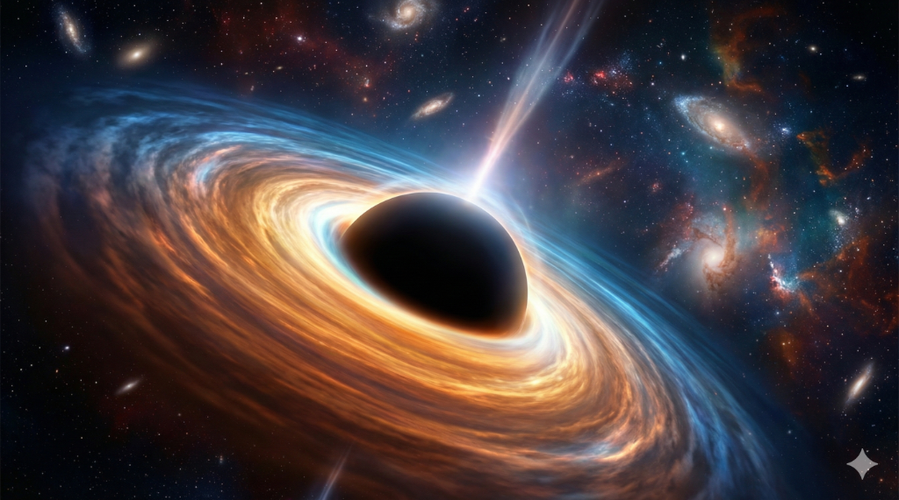

<div align="center">
  

  <h1>Black Hole Explorer & Quantum Chaos</h1>
  
  <p>
    <strong>A Computational Framework for Relativistic Astrophysics and Quantum Chaos Visualization</strong>
  </p>

  <p>
    <a href="https://api.nasa.gov/">
      
    </a>
    <a href="#">
      
    </a>
    <a href="#">
      
    </a>
  </p>
</div>

<hr />

## Abstract

Black Hole Explorer is a web-based research interface designed to bridge the gap between theoretical physics and interactive data visualization. This platform integrates real-time astrophysical data from NASA's archives with client-side simulations of relativistic phenomena. The project focuses on visualizing Schwarzschild and Kerr metric geodesics, Hawking radiation thermodynamics, and the diagnosis of quantum chaos through Out-of-Time-Order Correlators (OTOC) and Lyapunov exponents.

By leveraging modern web technologies (Vanilla JavaScript, CSS3), this repository demonstrates how complex mathematical models—typically reserved for Python or MATLAB environments—can be effectively rendered and explored in a browser environment with high performance.

## Core Architecture

### 1. Relativistic Physics Engine
The core application utilizes a custom JavaScript physics engine (`BlackHolePhysics` class) to compute real-time properties of black holes based on observational parameters.
*   **Schwarzschild Radius Calculation:** $R_s = \frac{2GM}{c^2}$
*   **Hawking Temperature:** $T_H = \frac{\hbar c^3}{8\pi G M k_B}$
*   **Bekenstein-Hawking Entropy:** $S_{BH} = \frac{k_B c^3 A}{4G\hbar}$

### 2. Quantum Chaos Diagnostics
The simulation module implements numerical methods to visualize the butterfly effect in holographic systems.
*   **MSS Bound Visualization:** Demonstrates the saturation of the Lyapunov exponent bound $\lambda_L \le \frac{2\pi k_B T}{\hbar}$.
*   **OTOC Growth:** Simulator for $C(t) = \langle [W(t), V(0)]^2 \rangle \sim e^{\lambda_L t}$.

### 3. Data Integration Layer
A robust fetch wrapper interfaces directly with the **NASA Image and Video Library API**, filtering for high-relevance astrophysical imagery (accretion disks, event horizons, active galactic nuclei) and presenting them in a curated, museum-grade gallery interface.

## Technical Stack

*   **Frontend:** HTML5, CSS3 (Custom Variables, Grid/Flexbox Layouts, Glassmorphism UI)
*   **Simulation Logic:** Vanilla JavaScript (ES6+ Classes, Async/Await)
*   **Visualization:** Chart.js for thermodynamic curves and chaos bounds
*   **Math Rendering:** MathJax for LaTeX equation support
*   **API:** NASA Open APIs

## Installation & Usage

This project is client-side only and requires no build pipeline or package manager.

1.  **Clone the repository**
    ```bash
    git clone https://github.com/yourusername/black-hole-explorer.git
    ```

2.  **Navigate to directory**
    ```bash
    cd black-hole-explorer
    ```

3.  **Launch**
    Open `index.html` in any modern web browser (Chrome, Firefox, Safari, Edge).
    
    *Note: For API functionality to work without strict CORS policies on some local environments, consider running a simple python server:*
    ```bash
    python3 -m http.server 8000
    ```

## Project Structure

```bash
.
├── index.html          # Main dashboard & core UI
├── advanced-math.html  # Mathematical derivations & formalisms
├── simulations.html    # Interactive chaos & physics simulators
├── styles.css          # Global design system & responsive layout
├── app.js              # Physics engine & API logic
└── hero-bg.png         # Cinematic assets
```

## Contributing

Contributions to the physics engine or UI refinements are welcome. Please ensure all mathematical implementations cite valid sources (arXiv, standard textbooks) in pull request descriptions.

1.  Fork the Project
2.  Create your Feature Branch (`git checkout -b feature/AmazingPhysics`)
3.  Commit your Changes (`git commit -m 'Add Kerr metric support'`)
4.  Push to the Branch (`git push origin feature/AmazingPhysics`)
5.  Open a Pull Request

## License

Distributed under the MIT License. See `LICENSE` for more information.

---

<div align="center">
  <small>&copy; 2026 Black Hole Explorer Research Platform. Data courtesy of NASA.</small>
</div>
